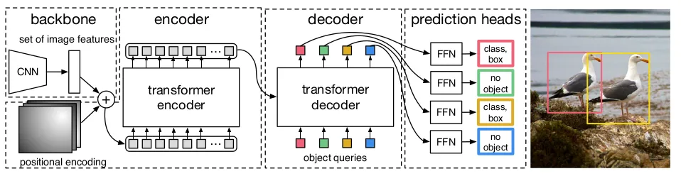
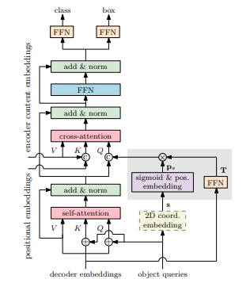
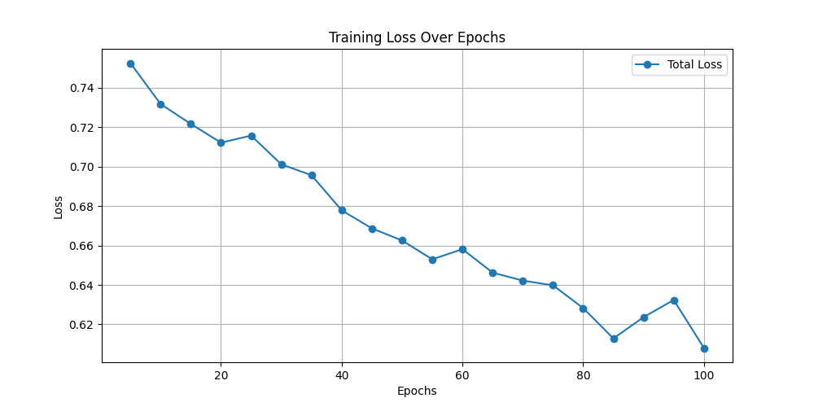
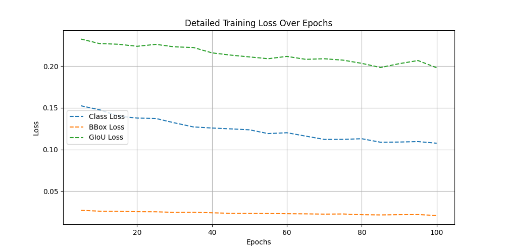

# Building and training the DETR (Detection Transformer) models with PyTorch
This project is an implementation of the Detection Transformer(DETR) and the Conditional DETR(CondDETR) variant, for state-of-the-art object detection using the well-known Transformer architecture. 

This project makes training, fine-tuning and evaluation of the DETR models simple and straightforward on your own dataset. 

**Note**: Feel free to share thoughts, raise issues or open a PR if you feel like helping with developing this project further.

## Contents

- [What is DETR? How can we use it for object detection?](#what-is-detr-how-can-we-use-it-for-object-detection)

- [Project structure: Building all the pieces for DETR](#project-structure-building-all-the-pieces-for-detr)

- [Case study: Fine-tuning and evaluating DETR on a small dataset](#case-study-fine-tuning-and-evaluating-detr-on-a-small-dataset)

- [Train, fine-tune or evaluate your own DETR model for object detection](#train-fine-tune-or-evaluate-your-own-detr-model-for-object-detection)

- [Pre-trained weights](#pre-trained-weights-for-detr)

- [References](#references)

## What is DETR? How can we use it for object detection?
Detection Transformer (DETR) is an object detection model developed by **Meta AI**. It combines Transformers with CNNs to directly predict object bounding boxes and labels without the need for region proposals or post-processing like Non-Maximum Suppression (NMS). DETR excels at handling complex scenes and works well without the need of complex post-processing techniques or anchor boxes.

### The baseline DETR architecture

<p align="center">
  
</p>
<p align="center"><b>Figure 1:</b> The baseline architecture for DETR</p>

This end-to-end object detection model combines a convolutional backbone (such as ResNet) for feature extraction with a Transformer encoder-decoder architecture. The Transformer processes image features as a sequence of embeddings, capturing global relationships across the image. Instead of traditional region proposals, DETR uses a set-based prediction approach with learnable object queries and bipartite matching loss (Hungarian algorithm) to directly predict object bounding boxes and class labels, making it simpler and more efficient than conventional detectors like Faster R-CNN.

### The Conditional DETR architecture
<p align="center">
  
</p>
<p align="center"><b>Figure 2:</b> The decoder's architecture for Conditional DETR</p>

Conditional DETR improves upon DETR by refining how object queries interact with image features. Instead of the fixed spatial attention mechanism used in DETR, Conditional DETR introduces **conditional cross-attention**, which makes object queries more location-aware. This allows the model to focus on relevant regions more effectively, leading to faster convergence and improved performance, especially for small objects. Additionally, by incorporating **modulated attention mechanisms**, Conditional DETR reduces redundancy in query updates, making it more efficient in training and inference.


### The training objective
In order to train DETR, the authors of the [original paper](https://arxiv.org/abs/2005.12872) developed a comprenensive but relatively simple loss function to optimize the models parameters during training. The loss function is defined as:

- **DETR Loss** = λ_cls * L_cls + λ_bbox * L_bbox + λ_giou * L_giou


where:  
- `L_cls` is the classification loss (Cross-Entropy).  
- `L_bbox` is the L1 loss for bounding box regression.  
- `L_giou` is the Generalized IoU (GIoU) loss.  
- `λ_cls, λ_bbox, λ_giou` are weighting coefficients with default values of 1, 2 and 5 respectively.

During training, for each sample first the Hungarian algorithm is applied to re-order predicted boxes to the best matching ground truth objects. For now we won't dive into any details on how that is done. Afterwards the weighted sum of the losses explained above is calculated for the re-ordered samples and the process is repeat for all samples present in the training set.

## Project structure: Building all the pieces for DETR
This project was developed in order to make training, testing the DETR object detection as simple and straightforward as possible. The project structure can be explained as:
```
├── readme-images # Image for the README file
|   ├── ....
├── README.md
├── src # Source code directory
│   ├── dataloaders # Contains code for the available dataset loaders (e.g. PyTorchCOCODataloader)
│   ├── datasets # Simple dataset information storage for fast iterations.
│   ├── detr.ipynb # The DETR notebook, this is your main file.
│   ├── models # Model related code and components (e.g. losses, model code, Evaluator and Trainer)
│   └── utils # Utility tools such as visualizers, inference decoding etc.
├── LICENSE # License file
```

The [DETR notebook](./src/detr.ipynb) provides an end-to-end workfow for training, fine-tuning and evaluating a DETR model on an object detection task. The notebook makes use of the following components:
-  [DETR model](./src/models/detr.py): The model architecture class implemented in PyTorch.

- [Conditional DETR model](./src/models/cond_detr.py): The Conditional DETR model class implemented in PyTorch.

- [PyTorchCOCODataLoader](./src/dataloaders/coco_od_pytorch.py): A simple yet efficient dataloader that can be used to easily prepare and load your object detection COCO dataset for training DETR.

- [DETRBoxVisualizer](./src/utils/visualizers.py): Visualizer class that can be used to plot ground truth boxes over an image, detection results over an image or the inference results of a random batch from a testing test. Useful to verify performance/dataset preparation.

- [DETRTrainer](./src/models/trainer.py): A trainer class that wraps all the logic related to the training of the model. Stores metrics from training time and internally so you can visualize the losses if you want to after training.

- [DERTEvaluator](./src/models/evaluator.py): An evaluator class based on the COCO API. You can use this class along with a dataset loaded with the [PyTorchCOCODataLoader](./src/dataloaders/coco_od_pytorch.py) to evaluate the performance of your model using metrics such as **AP (Average Precision) or AR (Average Recall) across different IoU (Intersection-over-Union) thresholds**.


## Case study: Fine-tuning and evaluating the DETR models on a small dataset
To showcase and test that all the parts of this project were implemented correctly, I conducted a small case study. Using the [DETR notebook](./src/detr.ipynb), some pre-trained weights from a previous experiment and the [People HQ](https://universe.roboflow.com/myroboflowprojects/people_hq) dataset from [Roboflow](https://roboflow.com/) I have attempted to train DETR how to detect people.

## Training the model
Transformers typically require a **significant amount of training time**, especially when trained from scratch. Therefore, it is highly recommended to fine-tune the model instead and start the training using pre-trained weights for all the heads.

For this PoC case study, **I have used pre-trained weights from a previous training with the [COCO people dataset](https://universe.roboflow.com/shreks-swamp/coco-dataset-limited--person-only) and then finetuned the models over the much smaller dataset I annotated using [Roboflow](https://roboflow.com/), for another ~100 epochs.** You can find the pre-trained weights and weights from this experiment [here](#pre-trained-weights-for-detr).

For reference, the total loss (weight sum of the GIoU, L1 bounding box loss and classification loss) as well as the separate losses from training time for DETR can be seen below:

<p align="center">
  
</p>
<p align="center"><b>Figure 1:</b> DETR Total loss from training time</p>

<p align="center">
  
</p>
<p align="center"><b>Figure 2:</b> Detailed DETR losses from training time</p>

As we can observe there seems to be much more space for improvements, as probably training for more epochs could probably lead to much better performance. Nevertheless, performance **seems quite decent for this Proof-of-Concept(PoC) case study.**

## Inference with DETR and ConditionalDETR
As we can see, despite the fact that the models were trained on a relatively small dataset with limited variance, they still demonstrate promising adaptability and meaningful detection capabilities:

<p align="center">
  
</p>
<p align="center"><b>Figure 3:</b> Inference with the DETR model trained to detect people</p>

<p align="center">
  
</p>
<p align="center"><b>Figure 4:</b> Inference with the Conditional DETR model trained to detect people</p>

## Evaluation results
The COCO API (see [pycocotools](https://pypi.org/project/pycocotools/)) offers various tools we can use to work with COCO-formatted datasets. One of the tools is a simple and effective evaluation suite which I have used to build an evaluator for our object detection model.


After evaluating the DETR models (DETR and ConditionalDETR), trained on ~500 images I collected and annotated ([People HQ dataset](https://universe.roboflow.com/myroboflowprojects/people_hq)), using the customized [DETR Evaluator](./src/models/evaluator.py) we got the following performance metrics over the small unseen testing set:

### Evaluation with the trained DETR

| Metric                   | Area    | Value  |
|--------------------------|--------|--------|
| **Average Precision (AP)** | all    | **0.271** |
| **Average Precision (AP)** | all (IoU=0.50) | **0.407** |
| **Average Precision (AP)** | all (IoU=0.75) | **0.297** |
| **Average Precision (AP)** | small  | **-1.000** |
| **Average Precision (AP)** | medium | **0.135** |
| **Average Precision (AP)** | large  | **0.282** |
| **Average Recall (AR)**    | all (maxDets=1)   | **0.153** |
| **Average Recall (AR)**    | all (maxDets=10)  | **0.298** |
| **Average Recall (AR)**    | all (maxDets=100) | **0.298** |
| **Average Recall (AR)**    | small  | **-1.000** |
| **Average Recall (AR)**    | medium | **0.190** |
| **Average Recall (AR)**    | large  | **0.309** |

### Evaluation with the Conditional DETR
| Metric                   | Area    | Value  |
|--------------------------|--------|--------|
| **Average Precision (AP)** | all    | **0.449** |
| **Average Precision (AP)** | all (IoU=0.50) | **0.759** |
| **Average Precision (AP)** | all (IoU=0.75) | **0.473** |
| **Average Precision (AP)** | small  | **0.007** |
| **Average Precision (AP)** | medium | **0.120** |
| **Average Precision (AP)** | large  | **0.561** |
| **Average Recall (AR)**    | all (maxDets=1)   | **0.140** |
| **Average Recall (AR)**    | all (maxDets=10)  | **0.540** |
| **Average Recall (AR)**    | all (maxDets=100) | **0.544** |
| **Average Recall (AR)**    | small  | **0.031** |
| **Average Recall (AR)**    | medium | **0.213** |
| **Average Recall (AR)**    | large  | **0.646** |

### Performance analysis for both models

#### DETR
The model performs moderately well, with an overall AP of ~0.29. It detects objects well at IoU=0.50 (AP=0.40) and does better with larger than medium sized objects. This however, is somewhat expected, as the dataset I annotated and used for this might not contain enough variance as I only used 430 images for training.

Recall improves with more detections (AR=0.153 for maxDets=1, rising to ~0.190 for maxDets=100 for medium and ~0.309 for larger sized objects).

#### Conditional DETR
Conditional DETR **shows a notable improvement over DETR** in terms of both precision and recall. The overall AP of 0.449 suggests better localization and classification performance. 

The increase in AP at IoU=0.50 (0.759) indicates improved object confidence. Larger objects still benefit the most, with an AP of 0.561, while small objects remain challenging (AP=0.007) (probably expected though due to the small size of the training set).

Recall is also significantly better, with AR=0.140 for maxDets=1 and increasing to 0.544 for maxDets=100. This suggests that Conditional DETR is more effective at retrieving objects when multiple detections are allowed, particularly benefiting larger and medium-sized objects. The improvements indicate that Conditional DETR better handles object queries, leading to more accurate predictions.

## Train, fine-tune or evaluate your own DETR models for object detection

Training a DETR model for object detection is made as simple as possible with this project, using the [DETR notebook](./src/detr.ipynb) and any dataset under the [COCO format](https://docs.aws.amazon.com/rekognition/latest/customlabels-dg/md-coco-overview.html). As mentioned previously in the [Case study](#case-study-fine-tuning-and-evaluating-detr-on-a-small-dataset), you can either start a training from scratch or use whichever of the provided [pre-trained weights](#pre-trained-weights-for-detr) suits your task better.


### Pre-trained weights for DETR
You can test the model's performance using any of the trained weights listed below or use these as a starting point to fine-tune a DETR (or Conditional DETR) model on your own dataset.

### 🏆 Model Checkpoints
You can use any of the weights listed below depending on the task you want to solve. 

**NOTE**: Only the COCO weights were trained from scratch, the rest of the checkpoints come from models fine-tuned on the COCO weights.

| 🏷 **Model** | 🗂 **Dataset** | 🔁 **Epochs(T+F)** | 📂 **Weights** |
|--------------|--------------|-------------|----------------|
| **DETR** | [COCO](https://cocodataset.org/#home) | **150** | [⬇ coco_detr_150.pt](https://drive.google.com/file/d/15mHkKghGy8fltpz2Wqcw137imzSiVFGh/view?usp=drive_link) |
| **DETR** | [COCO-People only](https://universe.roboflow.com/shreks-swamp/coco-dataset-limited--person-only) | **195** | [⬇ coco_people_45.pt](https://drive.google.com/file/d/1GFkyJBzaOH0hJRi3XEE-dD61phjwP2oW/view?usp=drive_link) |
| **DETR** | [People HQ](https://universe.roboflow.com/myroboflowprojects/people_hq) | **250** | [⬇ detr_people_hq.pt](https://drive.google.com/file/d/1usqAao4mYu_lkIApmVuqx-sbsL4lqLod/view?usp=drive_link) |
| **Conditional DETR** | [People HQ](https://universe.roboflow.com/myroboflowprojects/people_hq) | **120** | [⬇ cond_detr_people_hq.pt](https://drive.google.com/file/d/1iNFs2S39iE43EcE6YGd0F701U9hXjGGu/view?usp=drive_link) |


As you will see [here](#create-a-pytorch-dataloader-and-parse-your-dataset), you can load the dataset-specific information (e.g. "empty" box class ID, class names etc.) for all the dataset's listed above. You can look for the available keys as:
```
from datasets.info import DATASET_CLASSES
print(f"Available datasets: {DATASET_CLASSES.keys()}")
```

### Using the notebook
You can use the [DETR notebook](./src/detr.ipynb) either on Collab or locally and train/evaluate a model either on a GPU or CPU machine. The code handles the data transfers for both evaluation/inference/training automatically depending on your system. 

Moving on an end-to-end usage of the notebook first import the necessary dependencies:

#### Import Python dependencies

```
import torch
from torch import nn
from torch.utils.data import DataLoader
from torchvision import ops

# Import the custom COCO dataset loader
from dataloaders.coco_od_pytorch import TorchCOCOLoader, collate_fn
from models.detr import DETR
```

#### Set the experiment configurations
In this step you can adjust the following configurations according to your dataset/hardware limitations.
```
# Batch size for dataloaders and image size for model/pre-processing
BATCH_SIZE = 4
IMAGE_SIZE = 480
MAX_OBJECTS = 100
FREEZE_BACKBONE = True
EPOCHS = 150
LOG_FREQUENCY = 5 # Training-time losses will be logged according to this frequency
SAVE_FREQUENCY = 20 # Model weights will be saved according to this frequency
device = torch.device("cuda" if torch.cuda.is_available() else "cpu") # Training device
```
Use settings such as `LOG_FREQUENCY` to control how often you want the losses of the DETR model to be tracked and logged during training, `SAVE_FREQUENCY` to control how often a weights checkpoint is saved, `MAX_OBJECTS` to control the maximum number of objects DETR will be trained to detect in an image or `FREEZE_BACKBONE` to control wether the *"ResNet50"* backbone CNN network of the model will also receive weight updates during training.

#### Create a PyTorch dataloader and parse your dataset
```
....Handle a new custom dataset................

CLASSES = ["N/A", "person"]
EMPTY_CLASS_ID = 0 # ID of the dataset classes to treat as "empty" class

....Or import information for one of the available datasets....

from datasets.info import DATASET_CLASSES
CLASSES = DATASET_CLASSES["coco"]["class_names"]
EMPTY_CLASS_ID = "CLASSES" = DATASET_CLASSES["coco"]["empty_class_id"]

...

# Load and COCO dataset (adjust the paths accordingly)
coco_ds_train = TorchCOCOLoader(
    '../<PATH_TO_DATASET>/train',
    '../<PATH_TO_DATASET>/train/<YOUR_ANNOTATIONS_FILE>.json',
    max_boxes=MAX_OBJECTS,
    empty_class_id=EMPTY_CLASS_ID,
    image_size=IMAGE_SIZE,
)

coco_ds_val = TorchCOCOLoader(...)
train_loader = DataLoader(...)
val_loader = DataLoader(...)
```

#### Verify dataset preparation by plotting some samples
Use the [DETRBoxVisualizer class](./src/utils/visualizers.py) to visualize some images and ground truth boxes from your dataset, in order to verify pre-processing and correct preparation for training.
```
import matplotlib.pyplot as plt
from utils.visualizers import DETRBoxVisualizer

# Create a visualizer
visualizer = DETRBoxVisualizer(class_labels= CLASSES,
                               empty_class_id=0)

# Visualize batches
dataloader_iter = iter(train_loader)
for i in range(1):
    input_, (classes, boxes, masks, _) = next(dataloader_iter)
    fig = plt.figure(figsize=(10, 10), constrained_layout=True)

    for ix in range(4):
        ....
        visualizer._visualize_image(im, t_bbox, t_cl, ax=ax)
```

#### Build a DETR model and optionally load pre-trained weights as starting point
```
# Model trained on COCO (92 classes...)
# to fine-tune on a new dataset with...
detr_model = DETR(
    d_model=256, n_classes=92, n_tokens=225, 
    n_layers=6, n_heads=8, n_queries=MAX_OBJECTS
)
...
CHECKPOINT_PATH = "<YOUR_DETR_WEIGHTS.pt>"

# Load the checkpoint
checkpoint = torch.load(CHECKPOINT_PATH, map_location=torch.device("cpu"))

# Load the weights into the model
print(detr_model.load_state_dict(checkpoint['state']))

# Adapt the class prediction head to our new dataset (with len(CLASSES) number of classes)
detr_model.linear_class = nn.Linear(detr_model.linear_class.in_features, len(CLASSES))
```

#### Use the DETRTrainer to start the training
The [DETRTRainer](./src/models/trainer.py) wraps all the training logic for DETR under a single class interface, therefore all you need to do after instantiating a `DETRTrainer` class instance with your settings is to call the `.train()` method to start the training and (optionally) afterwards the `.visualize_losses()` method to see the loss curves from the training time of your model:
```
from models.trainer import DETRTrainer

# Create a trainer for DETR
trainer = DETRTrainer(model = detr_model,
                      train_loader= train_loader,
                      val_loader=val_loader,
                      device=device,
                      epochs=EPOCHS,
                      batch_size=BATCH_SIZE,
                      log_freq=5,
                      save_freq=SAVE_FREQUENCY,
                      freeze_backbone= FREEZE_BACKBONE,
                      num_queries=MAX_OBJECTS,
                      empty_class_id=EMPTY_CLASS_ID)

# Start the training
trainer.train()
...
trainer.visualize_losses(save_dir = "./")
```

#### Evaluate the performance of your trained model
Finally, the notebook allows you also to evaluate the performance of your model over a testing [PyTorch COCO dataset](https://pytorch.org/vision/0.17/generated/torchvision.datasets.CocoDetection.html), using the dedicated [DETREvaluator](./src/models/evaluator.py) class as:
```
from models.evaluator import DETREvaluator

evaluator = DETREvaluator(detr_model, coco_ds_val, device, EMPTY_CLASS_ID, collate_fn)
stats = evaluator.evaluate()
```

## References

- [Original Paper: End-to-end Object Detection with Transformers](https://arxiv.org/abs/2005.12872): The original DETR paper from Meta AI.

- [Understanding and coding DETR by Rafael Toledo](https://medium.com/@rafaeltol/understanding-and-coding-detr-detection-transfomer-80e4c206fbc8): The Medium article used as inspiration for this work.

- [Conditional DETR for Fast Training Convergence](https://arxiv.org/abs/2108.06152): The original Conditional DETR paper with the learnable anchor embeddings in the decoder.
