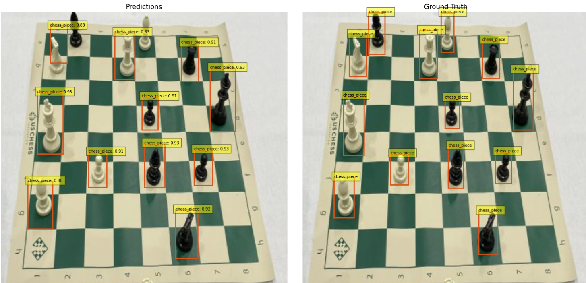
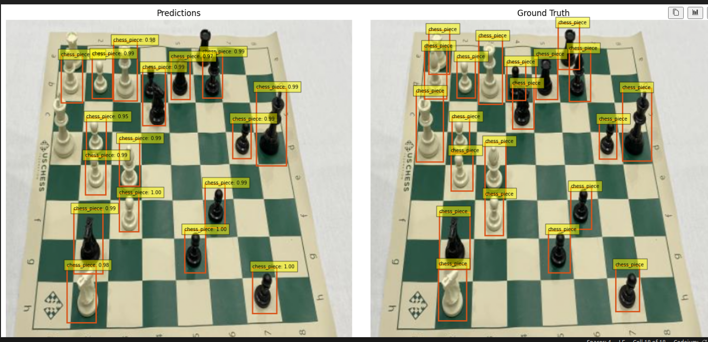

# Building and training a DETR (Detection Transformer) model with PyTorch
This project is an implementation of the Detection Transformer(DETR) for state-of-the-art object detection using the well-known Transformer architecture. This project makes training, fine-tuning and evaluation of the DETR model simple and straightforward on your own dataset.

## Training the model
As transformers typically require a **significant amount of time** especially when trained from scratch it is highly recommended to fine-tune the model instead and start the training using pre-trained weights for all the heads. For the experiment conducted in the [DETR notebook](./src/detr.ipynb) **I have used pre-trained weights from a previous training with the COCO dataset (~150 epochs on the complete COCO) and fine-tuned the model with the Chess Pieces dataset for another 100 epochs**.

The total loss (weight sum of the GIoU, L1 bounding box loss and classification loss) as well as the separate losses from training time can be seen below:

  

<b>Figure 1:</b> DETR Total loss from training time

  

<b>Figure 2:</b> Detailed DETR losses from training time

## Example inference results
Some example results from our trained DETR model over samples from the testing set of our dataset:

  

<b>Figure 3:</b> Model predictions on sample image 1.

  

<b>Figure 4:</b> Model predictions on sample image 2.

## Evaluation results
After evaluating the model trained on ~600 images from the chess pieces dataset we got these performance metrics from the COCO API.

| Metric                   | Area    | Value  |
|--------------------------|--------|--------|
| **Average Precision (AP)** | all    | **0.259** |
| **Average Precision (AP)** | all (IoU=0.50) | **0.546** |
| **Average Precision (AP)** | all (IoU=0.75) | **0.188** |
| **Average Precision (AP)** | small  | **0.241** |
| **Average Precision (AP)** | medium | **0.264** |
| **Average Precision (AP)** | large  | **-1.000** |
| **Average Recall (AR)**    | all (maxDets=1)   | **0.080** |
| **Average Recall (AR)**    | all (maxDets=10)  | **0.283** |
| **Average Recall (AR)**    | all (maxDets=100) | **0.317** |
| **Average Recall (AR)**    | small  | **0.266** |
| **Average Recall (AR)**    | medium | **0.329** |
| **Average Recall (AR)**    | large  | **-1.000** |

### Analysis of Model Performance
The model performs moderately well, with an overall AP of 0.259. It detects objects well at IoU=0.50 (AP=0.546) but struggles with precise localization at IoU=0.75 (AP=0.188).

Since the dataset mainly contains small and medium objects, the AP for small (0.241) and medium (0.264) objects is similar. Large objects (-1.000 AP/AR) do not exist in the dataset so the negative AR/AP values are reasonable.

Recall improves with more detections (AR=0.080 for maxDets=1, rising to 0.317 for maxDets=100). The model performs better on medium-sized objects (AR=0.329) than small ones (AR=0.266), aligning with dataset composition.

**More training and augmentations would probably lead to much better performance, however performance seems quite decent for the Proof-of-Concept(PoC) nature of the project.**
